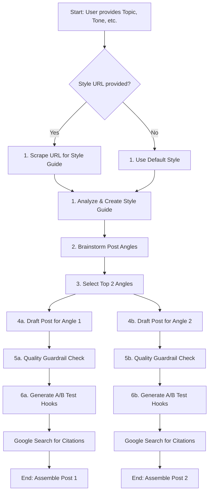

# Thinking AI: LinkedIn Post Generator

An advanced content generation tool that leverages an agentic AI workflow to create high-quality, engaging LinkedIn posts while streaming its reasoning in real-time.

[](https://nextjs.org/)
[](https://ai.google.dev/)
[](https://tailwindcss.com/)
[](https://vercel.com/)

## Overview

Creating consistently engaging content for professional platforms like LinkedIn is challenging and time-consuming. This tool goes beyond simple text generation by employing an **agentic AI model** that *thinks*, *plans*, and *researches* before writing.

You provide a topic, and the AI agent analyzes it, brainstorms unique angles, drafts two complete posts, and then enhances them with A/B testable hooks, data-driven hashtags, and authoritative citations. Best of all, you can watch the entire thought process unfold in the "Show thinking" panel, providing full transparency into the AI's strategy.

## Core Features

This application is packed with features designed to streamline your content creation process. The table below outlines the key functionalities:

| Feature | Description |
|---------|-------------|
| Dynamic Post Generation | Simply enter a topic, and the AI generates two complete, distinct posts ready for publishing. |
| Customizable Voice & Style | Define your target Audience and Tone using presets or custom inputs. Provide a URL to a LinkedIn post, and the AI will mimic its writing style, including emoji usage, formatting, and sentence structure. |
| A/B Testable Hooks | Each post comes with multiple hook variations (questions and statements) organized in an accordion, allowing you to choose the perfect opener to maximize engagement. |
| Data-Driven Hashtags | The agent uses Google Search as a tool to find relevant and trending hashtags for your topic, increasing post visibility. |
| Authoritative Citations | To enhance credibility, the AI finds and links to recent, authoritative sources related to the post content. |
| Transparent AI Reasoning | A real-time stream shows you the AI's step-by-step plan, from scraping URLs to brainstorming angles and searching for hashtags. |
| Quality & Safety Guardrail | A built-in check reviews generated content for professionalism and appropriateness before it's presented to you. |
| API Health Check | The UI includes a service status indicator to confirm that the backend AI service is online and operational. |
| Seamless Export | Easily copy the post body, hashtags, or the entire formatted post with a single click, or save it as a .txt file. |

## The Agentic Workflow

What makes this tool special is its agentic AI workflow. Instead of executing a single, massive prompt, the AI acts as an autonomous agent that breaks down the complex task of "writing a good LinkedIn post" into a series of logical steps. It plans, uses tools, and refines its output to achieve a high-quality result.

### Workflow Visualization

This diagram illustrates the step-by-step process the AI agent follows:



### Step-by-Step Breakdown

1. **Understand Style**: The agent first determines the desired writing style. If a URL is provided, it uses a web scraper (Cheerio) to fetch the content and then analyzes it to create a dynamic style guide. Otherwise, it uses the default tone specified by the user.
2. **Plan the Attack (Angle Brainstorming)**: Before writing, the agent acts as a content strategist. It brainstorms several potential angles for the topic, considering the target audience, and then selects the two most unique and compelling ones to proceed with.
3. **Draft Content**: For each chosen angle, the agent drafts the main body of the post, focusing on creating valuable and engaging content that adheres to the style guide.
4. **Quality & Safety Control**: Each draft is passed through a guardrail check. The agent reviews the text for any unprofessional or inappropriate content. If any issues are found, it sanitizes the text; otherwise, it marks it as "APPROVED".
5. **Refine & Enhance (Hook Generation)**: The agent generates multiple A/B testable hooks (both questions and statements) based on the opening line of each post, providing options to capture the audience's attention.
6. **Research & Verify (Tool Use)**: In the final step, the agent uses Google Search as a tool to find:
   - Relevant and trending LinkedIn hashtags.
   - 2-3 recent, authoritative articles to use as citations, adding credibility and depth to the post.
7. **Assemble & Deliver**: The agent assembles all the generated components—angle, hooks, content, hashtags, and citations—into the final PostCard components displayed in the user interface.

## Tech Stack

- **Framework**: Next.js (with Turbopack for faster builds)
- **AI Model**: Google Gemini Pro & Flash (for advanced reasoning and generation)
- **Styling**: Tailwind CSS (for responsive and modern UI)
- **UI Components**: shadcn/ui (built on Radix UI + Tailwind CSS for accessible components)
- **Web Scraping**: Cheerio (for extracting style from LinkedIn URLs)
- **Deployment**: Vercel (for seamless hosting and scaling)

## Getting Started

Follow these steps to get the project running on your local machine.

### Prerequisites

- Node.js (v18.18.0 or later)
- npm, yarn, or pnpm

### 1. Clone the Repository

```bash
git clone https://github.com/euclidstellar/linkedin-nugget.git
cd linkedin-nugget
```

### 2. Install Dependencies

```bash
npm install
```

### 3. Set Up Environment Variables

You'll need a Google Gemini API key to run this project.

1. Create a file named `.env.local` in the root of the project.
2. Get your API key from [Google AI Studio](https://aistudio.google.com/app/apikey).
3. Add the key to your `.env.local` file:

   ```env
   GOOGLE_API_KEY="YOUR_API_KEY_HERE"
   ```

### 4. Run the Development Server

```bash
npm run dev
```

Open [http://localhost:3000](http://localhost:3000) in your browser to see the result.

## Deploy on Vercel

The easiest way to deploy your Next.js app is to use the [Vercel Platform](https://vercel.com/new?utm_medium=default-template&filter=next.js&utm_source=create-next-app&utm_campaign=create-next-app-readme) from the creators of Next.js.

Don't forget to add your `GOOGLE_API_KEY` as an environment variable in your Vercel project settings.

## Usage

1. Enter a topic in the input field.
2. Optionally, specify audience, tone, and provide a style URL.
3. Click "Generate Posts" to start the AI workflow.
4. Watch the real-time thinking stream in the "Show thinking" panel.
5. Review the generated posts, select hooks, and export as needed.

## Contributing

Contributions are welcome! Please open an issue or submit a pull request.

## License

This project is licensed under the MIT License - see the [LICENSE](LICENSE) file for details.